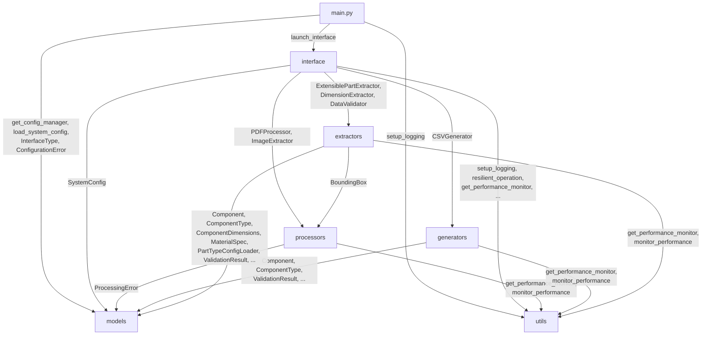

# Architecture: Cross-Folder Dependencies

## Key Observations

- **models** and **utils** are pure leaf packages — zero outward cross-folder dependencies, imported by every other package.
- **interface** (`web_interface.py`) is the orchestration layer — it touches all five other subpackages.
- **main.py** is a thin entry point delegating to interface, models, and utils.
- **extractors** depends on both **models** (data classes) and **processors** (`BoundingBox`).
- **processors** does NOT depend on extractors or generators, keeping its dependency surface small.
- **utils** (especially `performance_monitor`) is the most universally depended-upon module.
